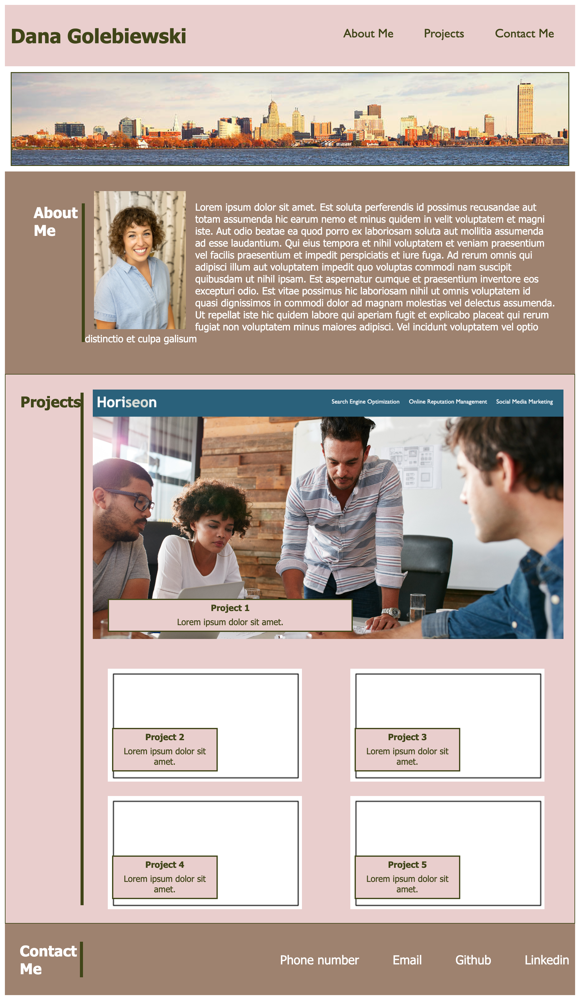

# Challenge 2 - Portfolio

By Dana Golebiewski

## Description 
For this challenge, I created a portfolio web application with no starter code. This challange is meant to create a portfolio that I can add projects to to preseent to future employers. 

The skills used in this challenge are flexbox, media queries, CSS variables, and HTML. 

## Built With 
HTML and CSS 

## Link to final version 

[Site Link](https://danagolebiewski.github.io/dana-golebiewski-challenge-2//)

## Website Preview

